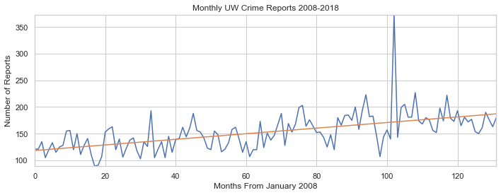
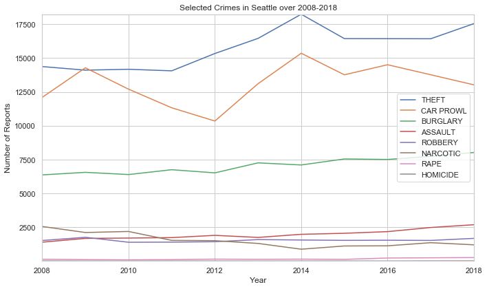

```javascript
%%javascript
IPython.OutputArea.prototype._should_scroll = function(lines) {return false;}
```


    <IPython.core.display.Javascript object>


 # Analysis of Crime Reports in UW and Seattle
Hello viewer and welcome to my data analysis of crime data in Seattle! We will be analyzing crime reports in UW and Seattle over the last 10 years and drawing conclusions from this data

## Importing dependencies and creating Seattle dataframes

The first step towards this analysis is to import all of the necessary libraries to use later down on the road. As the comments suggest, we import numpy for converting lists to arrays for linear regression, we import pandas for data manipulation and reading csv files, we import matplotlib.pyploy for plotting data, we import LinearRegression from sklearn for linear regression, we import datetime to convert dates to date time, and we import math for the floor() method for grouping time.


```python
%matplotlib inline
import numpy as np # for converting lists to arrays
import pandas as pd # for data reading, cleaning, and manipulation
import matplotlib.pyplot as plt # for plotting
#plt.rcParams['figure.dpi']= 200 # to make graphs nicer
# for making plotting pretty
import seaborn as sns
sns.set(style="whitegrid")
#sns.set_context("notebook", font_scale=1.5, rc={"lines.linewidth": 2.5})
from sklearn.linear_model import LinearRegression # for creating best fit lines to see trends in vast data
from datetime import datetime # for converting dates to datetimes
import math # for rounding

# reads crime data file
df = pd.read_csv('Crime_data.csv')

# creates dataframe with Seattle population by 100,000 by year from 2010-2018 from the us census estimates
data = [['2008', 6.03404], ['2009', 6.18420], ['2010', 6.10639], ['2011', 6.23050], 
        ['2012', 6.36495], ['2013', 6.54224], ['2014', 6.70925], ['2015', 6.88156], 
        ['2016', 7.10510], ['2017', 7.29601], ['2018', 7.44955]]

pop = pd.DataFrame(data, columns = ['year', 'population100'])
```

The crime data for Seattle came from Seattle.gov which contains every police report since 2008. There are some inputs for reports prior to 2008, but we will get rid of those e

The population data for the created dataframe came from US census estimates trough American FactFinder

## Cleaning dataframes and Creation of UW dataframe

To get a better understanding of our data, lets see the stucture of the dataframe.


```python
df.head()
```


<div>
<style scoped>
    .dataframe tbody tr th:only-of-type {
        vertical-align: middle;
    }

    .dataframe tbody tr th {
        vertical-align: top;
    }

    .dataframe thead th {
        text-align: right;
    }
</style>
<table border="1" class="dataframe">
  <thead>
    <tr style="text-align: right;">
      <th></th>
      <th>Report Number</th>
      <th>Occurred Date</th>
      <th>Occurred Time</th>
      <th>Reported Date</th>
      <th>Reported Time</th>
      <th>Crime Subcategory</th>
      <th>Primary Offense Description</th>
      <th>Precinct</th>
      <th>Sector</th>
      <th>Beat</th>
      <th>Neighborhood</th>
    </tr>
  </thead>
  <tbody>
    <tr>
      <th>0</th>
      <td>1975000079415</td>
      <td>12/16/1975</td>
      <td>900.0</td>
      <td>12/16/1975</td>
      <td>1500.0</td>
      <td>BURGLARY-RESIDENTIAL</td>
      <td>BURGLARY-FORCE-RES</td>
      <td>SOUTH</td>
      <td>R</td>
      <td>R3</td>
      <td>LAKEWOOD/SEWARD PARK</td>
    </tr>
    <tr>
      <th>1</th>
      <td>1976000069169</td>
      <td>01/01/1976</td>
      <td>1.0</td>
      <td>01/31/1976</td>
      <td>2359.0</td>
      <td>SEX OFFENSE-OTHER</td>
      <td>SEXOFF-INDECENT LIBERTIES</td>
      <td>UNKNOWN</td>
      <td>NaN</td>
      <td>NaN</td>
      <td>UNKNOWN</td>
    </tr>
    <tr>
      <th>2</th>
      <td>1979000049118</td>
      <td>01/28/1979</td>
      <td>1600.0</td>
      <td>02/09/1979</td>
      <td>1430.0</td>
      <td>CAR PROWL</td>
      <td>THEFT-CARPROWL</td>
      <td>EAST</td>
      <td>G</td>
      <td>G2</td>
      <td>CENTRAL AREA/SQUIRE PARK</td>
    </tr>
    <tr>
      <th>3</th>
      <td>19810000305573</td>
      <td>08/22/1981</td>
      <td>2029.0</td>
      <td>08/22/1981</td>
      <td>2030.0</td>
      <td>HOMICIDE</td>
      <td>HOMICIDE-PREMEDITATED-WEAPON</td>
      <td>SOUTH</td>
      <td>S</td>
      <td>S2</td>
      <td>BRIGHTON/DUNLAP</td>
    </tr>
    <tr>
      <th>4</th>
      <td>1981000076456</td>
      <td>02/14/1981</td>
      <td>2000.0</td>
      <td>02/15/1981</td>
      <td>435.0</td>
      <td>BURGLARY-RESIDENTIAL</td>
      <td>BURGLARY-FORCE-RES</td>
      <td>SOUTHWEST</td>
      <td>W</td>
      <td>W3</td>
      <td>ROXHILL/WESTWOOD/ARBOR HEIGHTS</td>
    </tr>
  </tbody>
</table>
</div>


This dataframe carries many different columns, some of which we are not intrested in. We are only intrested in the 
* Occurred Date
* Occurred Time 
* Crime Subcategory
* Neighborhood

We will filter the dataframes for these values after renaming those columns for ease.


```python
# renames columns
df.rename(columns = {
    'Occurred Date' : 'date', 
    'Occurred Time' : 'time', 
    'Crime Subcategory' : 'type', 
    'Neighborhood' : 'neighborhood'}, inplace=True)

# trims down df to only include date, type, time, and neighborhood
df = df[['date', 'time', 'type', 'neighborhood']]

df.head()
```


<div>
<style scoped>
    .dataframe tbody tr th:only-of-type {
        vertical-align: middle;
    }

    .dataframe tbody tr th {
        vertical-align: top;
    }

    .dataframe thead th {
        text-align: right;
    }
</style>
<table border="1" class="dataframe">
  <thead>
    <tr style="text-align: right;">
      <th></th>
      <th>date</th>
      <th>time</th>
      <th>type</th>
      <th>neighborhood</th>
    </tr>
  </thead>
  <tbody>
    <tr>
      <th>0</th>
      <td>12/16/1975</td>
      <td>900.0</td>
      <td>BURGLARY-RESIDENTIAL</td>
      <td>LAKEWOOD/SEWARD PARK</td>
    </tr>
    <tr>
      <th>1</th>
      <td>01/01/1976</td>
      <td>1.0</td>
      <td>SEX OFFENSE-OTHER</td>
      <td>UNKNOWN</td>
    </tr>
    <tr>
      <th>2</th>
      <td>01/28/1979</td>
      <td>1600.0</td>
      <td>CAR PROWL</td>
      <td>CENTRAL AREA/SQUIRE PARK</td>
    </tr>
    <tr>
      <th>3</th>
      <td>08/22/1981</td>
      <td>2029.0</td>
      <td>HOMICIDE</td>
      <td>BRIGHTON/DUNLAP</td>
    </tr>
    <tr>
      <th>4</th>
      <td>02/14/1981</td>
      <td>2000.0</td>
      <td>BURGLARY-RESIDENTIAL</td>
      <td>ROXHILL/WESTWOOD/ARBOR HEIGHTS</td>
    </tr>
  </tbody>
</table>
</div>


Great! Now our columns only contain those columns. Lets check the types of each columns to see if we need to convert anything


```python
df.dtypes
```


    date             object
    time            float64
    type             object
    neighborhood     object
    dtype: object


Well that time doesn't look quite right. Lets convert that to datetime format and at the same time removes all rows with a null type and date.


```python
# converts dates into datetime, by specifying format we speed up process immensely
df.date = pd.to_datetime(df.date, format="%m/%d/%Y")

# removes all data with null type values (261 entries)
df = df[df.type.notnull()]

# removes all data with null date values (261 entries)
df = df[df.date.notnull()]
```

The only remaining issues with our data is the time, type, and date. Our time is displayed in military time, but for our purposes we only need the hour. 


```python
# removes minutes from time data as we are only interested in hours
df['time'] = df['time'].apply(lambda x: math.floor(x / 100))
```

Our type column might have serveral different types of crime subcategories. Let's check.


```python
df.type.unique().tolist()
```


    ['BURGLARY-RESIDENTIAL',
     'SEX OFFENSE-OTHER',
     'CAR PROWL',
     'HOMICIDE',
     'MOTOR VEHICLE THEFT',
     'THEFT-ALL OTHER',
     'DUI',
     'AGGRAVATED ASSAULT-DV',
     'RAPE',
     'AGGRAVATED ASSAULT',
     'ROBBERY-STREET',
     'BURGLARY-COMMERCIAL',
     'THEFT-BICYCLE',
     'NARCOTIC',
     'PROSTITUTION',
     'ARSON',
     'PORNOGRAPHY',
     'ROBBERY-COMMERCIAL',
     'FAMILY OFFENSE-NONVIOLENT',
     'THEFT-SHOPLIFT',
     'WEAPON',
     'THEFT-BUILDING',
     'ROBBERY-RESIDENTIAL',
     'TRESPASS',
     'LIQUOR LAW VIOLATION',
     'DISORDERLY CONDUCT',
     'GAMBLE',
     'LOITERING',
     'BURGLARY-COMMERCIAL-SECURE PARKING',
     'BURGLARY-RESIDENTIAL-SECURE PARKING']


As we can see, there are several different types of burgalry, aggravated assault, robbery, and theft. Later on in our research we will be grouping by crime type, and we do not want crimes such as burgalry split up. Lets fix this.


```python
# combines all types of burglary
df['type'] = df.type.apply(lambda x: "BURGLARY" if "BURGLARY" in x else x)

# combines all types of robbery
df['type'] = df.type.apply(lambda x: "ROBBERY" if "ROBBERY" in x else x)

# combines all types of assault
df['type'] = df.type.apply(lambda x: "ASSAULT" if "ASSAULT" in x else x)

# combines all types of theft
df['type'] = df.type.apply(lambda x: "THEFT" if "THEFT" in x else x)
```

Almost done! The only cleaning left to do in this data is to remove all values pre 2008. 


```python
# modifies df to only have dates within 2008 and 2018 inclusive
df = df[df.date >= '2008-01-01']
df.reset_index(drop=True, inplace=True)
```

We need to create the two dataframes that will store crime data for UW and Seattle 2008-2018. We do not want to include 2019 data as we are still in 2019.


```python
# modifies df to only have dates within 2008 and 2018 inclusive
crime_SEA = df[df.date.dt.year < 2019]
crime_SEA.reset_index(drop=True, inplace=True)

# crime dataframe in UW neighborhood 2008 to 2018 inclusive
crime_UW = crime_SEA[crime_SEA['neighborhood'] == 'UNIVERSITY'].reset_index(drop=True)
```

crime_SEA will hold all Seattle crime data from 2008-2018 and crime_UW will hold all crime data in UW from 2008-2018. It is important to note that df still holds data from 2008-2019. This will come in handy at the end of the analysis when we analysis UW crime data in 2019.

# Exploration of Crime Rate

Now that we have created all of our dataframes and they have been cleaned for easy use, lets answer some questions. 

### Has Seattle crime reports decreased in the last 10 years?

We need to see the change in crime reports over the last 10 years, and the best way to do this is using a simple graph. Plotting the number of crimes per day would be too hard to read, so lets plot it by month. We also want to create a function to shorten plotting code in the future. This function will be called plot() and take in a list of x values, y values, title, x label, and y label.


```python
# group Seattle crime to a count per day
seattle_per_month = crime_SEA.groupby([crime_SEA.date.dt.year, crime_SEA.date.dt.month])['type']
# counts the amount of crime per month
num_crimes = seattle_per_month.count()

# creates x list with months from January 2008
x = np.arange(len(num_crimes.values))
# creates y list with number of crimes each month
y = num_crimes.values

# method to shorten plotting code in the future
def plot(x, y, ax, title, x_label, y_label, legend=""):
    ax.set_title(title)
    ax.set_xlabel(x_label)
    ax.set_ylabel(y_label)
    if(legend != ""):
        ax.plot(x, y, label=legend)
    else :
        ax.plot(x, y)
    ax.margins(x=0, y=0)
```

Lets plot the data!


```python
# plots it with the method defined before
fig, ax = plt.subplots()
plot(x, y, ax, 'Monthly Seattle Crime Reports 2008-2018', 'Months From January 2008', 'Number of Reports')
fig.set_size_inches(10, 5)
fig.tight_layout()
```


Now this graph shows us that crime has steadily been increasing, but it does not show the whole picture. We need to look at the population growth over the same time span. Lets graph the population change in Seattle.


```python
# makes x list and y list from population dataframe
x = pop.year
y = pop.population100

# plots graph
fig, ax = plt.subplots()
plot(x, y, ax, 'Seattle Yearly Population 2008-2018', 'Year', 'Population by 100,000')
fig.set_size_inches(10, 5)
fig.tight_layout()
```


Wow! Thats a massive increase in population. Now how does our rise in crime compare to the rise in population? We can answer this by adjusting the crime reports for each month by the population of their respective year. Lets also replot our original graph to compare the differences. To better see the rise, fall, or stagnation of crime, we can use scikits LinearRegression() method to create a line of best fit.


```python
# creates x list from num_crimes already defined
x = np.arange(len(num_crimes.values))
# creates y list from num_crimes already defined
y = num_crimes.values
# creates population y list
pop_y = y.copy()

# converts number of crimes to reflect population
for i in range(len(pop_y)):
    year = math.floor(i / 12)
    pop_y[i] = pop_y[i] / np.array(pop.population100)[year]
    
# to create best fit line for non pop graph
line_fitter = LinearRegression()
line_fitter.fit(x.reshape(-1, 1), y)
y_predict = line_fitter.predict(x.reshape(-1, 1))

# to create best fit line for pop graph
line_fitter.fit(x.reshape(-1, 1), pop_y)
y_predict_pop = line_fitter.predict(x.reshape(-1, 1))

# plots it with the method defined before, and plots linear regression lines
fig, (ax1, ax2) = plt.subplots(nrows = 2)
plot(x, y, ax1, 'Monthly Seattle Crime Reports 2008-2018', 'Months From January 2008', 'Number of Reports')
ax1.plot(x, y_predict)
plot(x, pop_y, ax2, 'Monthly Seattle Crime Reports 2008-2018 per 100,000', 'Months From January 2008', 'Number of Reports per 100,000')
ax2.plot(x, y_predict_pop)
fig.set_size_inches(10, 8)
fig.tight_layout()
```


Our two graphs tell two different stories. When we purely analyze the crime reports without taking population into account, crime is rising. When we account for the rising population, crime is slightly declining.

### Has crime in UW increased over the last 10 years?

As a University of Washington student, I am curious to see if the university has been becoming safer over time. However, there is no population data avaliable for the University area. We can only see the number of reports, but can not compare the number of reports to the population 

Our process for visualizing crime data in UW will be very similar as the last section, but we will be pulling data from our crime_UW dataframe. We will also be implementing linear regression again to clearly see the trend in reports.


```python
# group Seattle crime to a count per day
uw_per_month = crime_UW.groupby([crime_UW.date.dt.year, crime_UW.date.dt.month])['type']
# counts the amount of crime per month
num_crimes = uw_per_month.count()

# creates x list with months from January 2008
x = np.arange(len(num_crimes.values))
# creates y list with number of crimes each month
y = num_crimes.values

# to create best fit line for pop graph
line_fitter.fit(x.reshape(-1, 1), y)
y_predict = line_fitter.predict(x.reshape(-1, 1))

# plots it with the method defined before
fig, ax = plt.subplots()
plot(x, y, ax, 'Monthly UW Crime Reports 2008-2018', 'Months From January 2008', 'Number of Reports')
ax.plot(x, y_predict)
fig.set_size_inches(10, 4)
fig.tight_layout()
```





Thanks to our handy linear regression line, we can see that the number of crime reports per month has been steadily increasing. Although this data isn't per 100,000 individuals, this is a steady increase of crime for such a small area.

# Exploration of Crimes

### What are the most common crimes in Seattle? How have the changed over the past 10 years?

Lets take a look at the data to see what are the most common crimes in Seattle. Lets group crimes in seattle by the year and by the type of crime. We can then create a pivot table from this. We can then sort by the number of reports this last year to get the most common crimes


```python
#  groups data by year and by crime
sea_crimes_year = crime_SEA.groupby([crime_SEA.date.dt.year, crime_SEA.type])
# counts different types of crime per year
crimes_levels = sea_crimes_year['neighborhood'].count().reset_index()

# renames count column to column
crimes_levels.rename(columns={'neighborhood': 'count'}, inplace=True)

common_crimes = crimes_levels.pivot(columns='type', index='date', values='count')

common_crimes = common_crimes.sort_values(by=2018, axis=1, ascending=False)

common_crimes.tail().sort_values('date', ascending=False)
```


<div>
<style scoped>
    .dataframe tbody tr th:only-of-type {
        vertical-align: middle;
    }

    .dataframe tbody tr th {
        vertical-align: top;
    }

    .dataframe thead th {
        text-align: right;
    }
</style>
<table border="1" class="dataframe">
  <thead>
    <tr style="text-align: right;">
      <th>type</th>
      <th>THEFT</th>
      <th>CAR PROWL</th>
      <th>BURGLARY</th>
      <th>TRESPASS</th>
      <th>ASSAULT</th>
      <th>ROBBERY</th>
      <th>DUI</th>
      <th>NARCOTIC</th>
      <th>SEX OFFENSE-OTHER</th>
      <th>FAMILY OFFENSE-NONVIOLENT</th>
      <th>WEAPON</th>
      <th>RAPE</th>
      <th>PROSTITUTION</th>
      <th>ARSON</th>
      <th>LIQUOR LAW VIOLATION</th>
      <th>DISORDERLY CONDUCT</th>
      <th>PORNOGRAPHY</th>
      <th>HOMICIDE</th>
      <th>LOITERING</th>
      <th>GAMBLE</th>
    </tr>
    <tr>
      <th>date</th>
      <th></th>
      <th></th>
      <th></th>
      <th></th>
      <th></th>
      <th></th>
      <th></th>
      <th></th>
      <th></th>
      <th></th>
      <th></th>
      <th></th>
      <th></th>
      <th></th>
      <th></th>
      <th></th>
      <th></th>
      <th></th>
      <th></th>
      <th></th>
    </tr>
  </thead>
  <tbody>
    <tr>
      <th>2018</th>
      <td>17546.0</td>
      <td>13026.0</td>
      <td>8033.0</td>
      <td>3405.0</td>
      <td>2698.0</td>
      <td>1690.0</td>
      <td>1213.0</td>
      <td>1213.0</td>
      <td>674.0</td>
      <td>593.0</td>
      <td>542.0</td>
      <td>273.0</td>
      <td>114.0</td>
      <td>99.0</td>
      <td>63.0</td>
      <td>44.0</td>
      <td>35.0</td>
      <td>32.0</td>
      <td>7.0</td>
      <td>2.0</td>
    </tr>
    <tr>
      <th>2017</th>
      <td>16429.0</td>
      <td>13771.0</td>
      <td>7743.0</td>
      <td>3063.0</td>
      <td>2492.0</td>
      <td>1537.0</td>
      <td>1224.0</td>
      <td>1371.0</td>
      <td>637.0</td>
      <td>650.0</td>
      <td>510.0</td>
      <td>255.0</td>
      <td>374.0</td>
      <td>139.0</td>
      <td>65.0</td>
      <td>17.0</td>
      <td>21.0</td>
      <td>28.0</td>
      <td>6.0</td>
      <td>NaN</td>
    </tr>
    <tr>
      <th>2016</th>
      <td>16435.0</td>
      <td>14511.0</td>
      <td>7518.0</td>
      <td>2213.0</td>
      <td>2188.0</td>
      <td>1552.0</td>
      <td>1045.0</td>
      <td>1140.0</td>
      <td>610.0</td>
      <td>661.0</td>
      <td>416.0</td>
      <td>239.0</td>
      <td>446.0</td>
      <td>97.0</td>
      <td>85.0</td>
      <td>26.0</td>
      <td>11.0</td>
      <td>19.0</td>
      <td>8.0</td>
      <td>NaN</td>
    </tr>
    <tr>
      <th>2015</th>
      <td>16440.0</td>
      <td>13768.0</td>
      <td>7554.0</td>
      <td>1763.0</td>
      <td>2065.0</td>
      <td>1543.0</td>
      <td>957.0</td>
      <td>1128.0</td>
      <td>573.0</td>
      <td>731.0</td>
      <td>467.0</td>
      <td>141.0</td>
      <td>335.0</td>
      <td>88.0</td>
      <td>77.0</td>
      <td>20.0</td>
      <td>12.0</td>
      <td>24.0</td>
      <td>5.0</td>
      <td>2.0</td>
    </tr>
    <tr>
      <th>2014</th>
      <td>18238.0</td>
      <td>15359.0</td>
      <td>7109.0</td>
      <td>1060.0</td>
      <td>1989.0</td>
      <td>1569.0</td>
      <td>970.0</td>
      <td>890.0</td>
      <td>521.0</td>
      <td>626.0</td>
      <td>327.0</td>
      <td>158.0</td>
      <td>308.0</td>
      <td>67.0</td>
      <td>87.0</td>
      <td>7.0</td>
      <td>11.0</td>
      <td>23.0</td>
      <td>2.0</td>
      <td>1.0</td>
    </tr>
  </tbody>
</table>
</div>


This table tells us the most common crimes in 2018 and their reports for the few previous years. We can see that Theft, Car Prowl, and Burglary are the most common crimes in Seattle. 

Does UW has the same common crimes?


```python
#  groups data by year and by crime
uw_crimes_year = crime_UW.groupby([crime_UW.date.dt.year, crime_UW.type])
# counts different types of crime per year
uw_crimes_levels = uw_crimes_year['neighborhood'].count().reset_index()

# renames count column to column
uw_crimes_levels.rename(columns={'neighborhood': 'count'}, inplace=True)

common_crimes = uw_crimes_levels.pivot(columns='type', index='date', values='count')

common_crimes = common_crimes.sort_values(by=2018, axis=1, ascending=False)

common_crimes.tail().sort_values('date', ascending=False)
```


<div>
<style scoped>
    .dataframe tbody tr th:only-of-type {
        vertical-align: middle;
    }

    .dataframe tbody tr th {
        vertical-align: top;
    }

    .dataframe thead th {
        text-align: right;
    }
</style>
<table border="1" class="dataframe">
  <thead>
    <tr style="text-align: right;">
      <th>type</th>
      <th>THEFT</th>
      <th>BURGLARY</th>
      <th>CAR PROWL</th>
      <th>TRESPASS</th>
      <th>ASSAULT</th>
      <th>ROBBERY</th>
      <th>SEX OFFENSE-OTHER</th>
      <th>NARCOTIC</th>
      <th>WEAPON</th>
      <th>DUI</th>
      <th>FAMILY OFFENSE-NONVIOLENT</th>
      <th>RAPE</th>
      <th>ARSON</th>
      <th>DISORDERLY CONDUCT</th>
      <th>PORNOGRAPHY</th>
      <th>HOMICIDE</th>
      <th>LIQUOR LAW VIOLATION</th>
      <th>GAMBLE</th>
      <th>LOITERING</th>
      <th>PROSTITUTION</th>
    </tr>
    <tr>
      <th>date</th>
      <th></th>
      <th></th>
      <th></th>
      <th></th>
      <th></th>
      <th></th>
      <th></th>
      <th></th>
      <th></th>
      <th></th>
      <th></th>
      <th></th>
      <th></th>
      <th></th>
      <th></th>
      <th></th>
      <th></th>
      <th></th>
      <th></th>
      <th></th>
    </tr>
  </thead>
  <tbody>
    <tr>
      <th>2018</th>
      <td>743.0</td>
      <td>446.0</td>
      <td>413.0</td>
      <td>173.0</td>
      <td>88.0</td>
      <td>55.0</td>
      <td>31.0</td>
      <td>27.0</td>
      <td>26.0</td>
      <td>22.0</td>
      <td>16.0</td>
      <td>10.0</td>
      <td>6.0</td>
      <td>3.0</td>
      <td>1.0</td>
      <td>1.0</td>
      <td>1.0</td>
      <td>NaN</td>
      <td>NaN</td>
      <td>NaN</td>
    </tr>
    <tr>
      <th>2017</th>
      <td>656.0</td>
      <td>552.0</td>
      <td>531.0</td>
      <td>154.0</td>
      <td>87.0</td>
      <td>58.0</td>
      <td>29.0</td>
      <td>33.0</td>
      <td>32.0</td>
      <td>26.0</td>
      <td>1.0</td>
      <td>12.0</td>
      <td>4.0</td>
      <td>1.0</td>
      <td>NaN</td>
      <td>1.0</td>
      <td>NaN</td>
      <td>NaN</td>
      <td>1.0</td>
      <td>1.0</td>
    </tr>
    <tr>
      <th>2016</th>
      <td>629.0</td>
      <td>497.0</td>
      <td>488.0</td>
      <td>91.0</td>
      <td>80.0</td>
      <td>70.0</td>
      <td>30.0</td>
      <td>9.0</td>
      <td>12.0</td>
      <td>20.0</td>
      <td>9.0</td>
      <td>12.0</td>
      <td>4.0</td>
      <td>NaN</td>
      <td>NaN</td>
      <td>1.0</td>
      <td>2.0</td>
      <td>NaN</td>
      <td>NaN</td>
      <td>206.0</td>
    </tr>
    <tr>
      <th>2015</th>
      <td>813.0</td>
      <td>441.0</td>
      <td>476.0</td>
      <td>120.0</td>
      <td>87.0</td>
      <td>67.0</td>
      <td>18.0</td>
      <td>46.0</td>
      <td>16.0</td>
      <td>12.0</td>
      <td>7.0</td>
      <td>4.0</td>
      <td>3.0</td>
      <td>1.0</td>
      <td>NaN</td>
      <td>1.0</td>
      <td>1.0</td>
      <td>NaN</td>
      <td>1.0</td>
      <td>1.0</td>
    </tr>
    <tr>
      <th>2014</th>
      <td>810.0</td>
      <td>320.0</td>
      <td>587.0</td>
      <td>64.0</td>
      <td>65.0</td>
      <td>53.0</td>
      <td>16.0</td>
      <td>9.0</td>
      <td>12.0</td>
      <td>19.0</td>
      <td>3.0</td>
      <td>7.0</td>
      <td>2.0</td>
      <td>NaN</td>
      <td>NaN</td>
      <td>NaN</td>
      <td>2.0</td>
      <td>NaN</td>
      <td>NaN</td>
      <td>NaN</td>
    </tr>
  </tbody>
</table>
</div>


We can see that the common crimes for Seattle and UW are fairly similar.

For the remainer of this exploration, lets focuse on specific common and violent crimes in Seattle. Lets look at Theft, Car Prowl, Burglary, Assault, Robbery, Rape, Homicide, and Narcotic Reports. This will give us a general overview of common crimes and common violent crimes.


```python
# crimes to remove
crimes = ['TRESPASS', 'DUI', 'SEX OFFENSE-OTHER', 'FAMILY OFFENSE-NONVIOLENT', 'WEAPON', 'PROSTITUTION', 'ARSON', 'LIQUOR LAW VIOLATION', 'DISORDERLY CONDUCT','PORNOGRAPHY', 'LOITERING', 'GAMBLE']

#filters columns for our selected columns
crimes_levels = crimes_levels[~crimes_levels.type.isin(crimes)].reset_index(drop=True)
# creates pivot table
crimes_levels = crimes_levels.pivot(columns='type', index='date', values='count')
# sorts pivot table by number of reports the 2018 year, so that legend shows
crimes_levels = crimes_levels.sort_values(by=2018, axis=1, ascending=False)

# defining method for plotting pivot tables
def pivot_plot(df, title, x_label, y_label):
    col = df.columns.tolist()
    fig, ax = plt.subplots()
    for i in range(len(col)):
        data = df[col[i]]
        x = data.index
        y = data.values
        plot(x, y, ax, title, x_label, y_label, col[i])
    fig.set_size_inches(10, 6)
    fig.tight_layout()
    plt.legend()
        
# using method
pivot_plot(crimes_levels, 'Selected Crimes in Seattle over 2008-2018', 'Year', 'Number of Reports')
```





From this graph we can easily see how the number of reports for theft, carprowl, assault, and burgalry are rising steadily while narcotics is the only apparent crime to decrease. We can see how the number of reports can change over time, but there are more questions to answer

## Is there specific months, days, and hours that our selected crimes are most likely to occur?

It is important to explore these trends as it will allow us to see when certain crimes are more likely to happen. Lets first take a look at each of our selected crimes and how they trend over the year


```python
sea_crimes_month = crime_SEA.groupby([crime_SEA.date.dt.month, crime_SEA.type])
crimes_levels = sea_crimes_month['neighborhood'].count().reset_index()

# renames count column to column
crimes_levels.rename(columns={'neighborhood': 'count'}, inplace=True)

#filters columns for our selected columns
crimes_levels = crimes_levels[~crimes_levels.type.isin(crimes)].reset_index(drop=True)
# creates pivot table
crimes_levels = crimes_levels.pivot(columns='type', index='date', values='count')
# sorts pivot table by number of reports the 2018 year, so that legend is in order
crimes_levels = crimes_levels.sort_values(by=1, axis=1, ascending=False)

# using method
pivot_plot(crimes_levels, 'Number of Reports of Selected Crimes in Seattle over each Month 2008-2018', 'Month', 'Number of Reports')
```


What did we find from this graph? 
* Rape, Robbery, and Homicide have little to no seasonal change
* Assault increases during the summer, remains steady in winter and spring
* Theft, Car Prowl, and Burglary all see a massive decrease in February
* Theft sees a rise until August, where it decreases to rise again in December
* Car Prowl and Burglary both have a local maximum in May, then decrease in June, then rise until October.

Lets now take a look at the week and see if there are any trends


```python
sea_crimes_week = crime_SEA.groupby([crime_SEA.date.dt.dayofweek, crime_SEA.type])
crimes_levels = sea_crimes_week['neighborhood'].count().reset_index()

# renames count column to column
crimes_levels.rename(columns={'neighborhood': 'count'}, inplace=True)

#filters columns for our selected columns
crimes_levels = crimes_levels[~crimes_levels.type.isin(crimes)].reset_index(drop=True)

# creates pivot table
crimes_levels = crimes_levels.pivot(columns='type', index='date', values='count')

# converts number dates into days using a hashmap
day_convert = {0: "Mon", 1: "Tues", 2: "Wed", 3: "Thur", 4: "Fri", 5: "Sat", 6: "Sun" }
crimes_levels.index = crimes_levels.index.map(lambda x: day_convert[x])

# defining method for plotting pivot tables with all different subplots
def pivot_plot_diff(df, title, x_label, y_label):
    col = df.columns.tolist()
    fig, axs = plt.subplots(2, math.floor(len(col) / 2))
    for i in range(len(col)):
        data = df[col[i]]
        x = data.index
        y = data.values
        plot(x, y, axs[(i % 2), math.floor(i / 2)], title, x_label, y_label, col[i])
        axs[(i % 2), math.floor(i / 2)].legend()
    fig.set_size_inches(15, 7)
    fig.tight_layout()
    
# using method
pivot_plot_diff(crimes_levels, 'Reports per Week', 'Day', 'Number of Reports')
```


What can we draw from these graphs?
* With the exlusion of Narcotics, crimes tend to peak during Friday or the weekend. This rise in crime can be because most people tend to have their days off on the weekends.
* Narcotics reports are highest during the early week, and lowest during the weekend. While it is impossible to draw any causation, we can hypothesize that Narcotic crimes are not similar to the other crimes shown

Now when are each of these crimes most reported during the day?


```python
sea_crimes_day = crime_SEA.groupby([crime_SEA.time, crime_SEA.type])
crimes_levels = sea_crimes_day['neighborhood'].count().reset_index()

# renames count column to column
crimes_levels.rename(columns={'neighborhood': 'count'}, inplace=True)

#filters columns for our selected columns
crimes_levels = crimes_levels[~crimes_levels.type.isin(crimes)].reset_index(drop=True)

# creates pivot table
crimes_levels = crimes_levels.pivot(columns='type', index='time', values='count')

# plotting
pivot_plot_diff(crimes_levels, 'Reports per Hour', 'Hour (Military)', 'Number of Reports')
```


We can take a look at different type periods and see which crimes are high
* Mid Day: Narcotic, Theft, Burgalry
* Afternoon: Burgalry, Assault, Carprowl, Robbery, Theft
* Night: Assault, Car Prowl, Robbery, Homicide, Rape

## Has UW's recent crime spree been normal?

Recently UW has been having a large amount of crime on and around campus. Lets take a look into the data to see if the crime reports in 2019 are unusual. First, lets create a dataframe to hold all UW crimes in 2019.


```python
# selects only crimes in 2019
seattle_2019 = df[df.date.dt.year == 2019]
seattle_2019.reset_index(drop=True, inplace=True)
# to select only university crimes
uw_2019 = seattle_2019[seattle_2019['neighborhood'] == 'UNIVERSITY'].reset_index(drop=True)
```

Lets group the data by week and see the number of reports for each week.


```python
uw_week_2019 = uw_2019.set_index('date')
uw_week_2019 = uw_week_2019.to_period(freq='w')
uw_week_2019.reset_index(inplace=True)
uw_week_2019 = uw_week_2019.groupby('date')
uw_week_2019 = uw_week_2019['type'].count().reset_index()
uw_week_2019
```


<div>
<style scoped>
    .dataframe tbody tr th:only-of-type {
        vertical-align: middle;
    }

    .dataframe tbody tr th {
        vertical-align: top;
    }

    .dataframe thead th {
        text-align: right;
    }
</style>
<table border="1" class="dataframe">
  <thead>
    <tr style="text-align: right;">
      <th></th>
      <th>date</th>
      <th>type</th>
    </tr>
  </thead>
  <tbody>
    <tr>
      <th>0</th>
      <td>2018-12-31/2019-01-06</td>
      <td>30</td>
    </tr>
    <tr>
      <th>1</th>
      <td>2019-01-07/2019-01-13</td>
      <td>53</td>
    </tr>
    <tr>
      <th>2</th>
      <td>2019-01-14/2019-01-20</td>
      <td>44</td>
    </tr>
    <tr>
      <th>3</th>
      <td>2019-01-21/2019-01-27</td>
      <td>38</td>
    </tr>
    <tr>
      <th>4</th>
      <td>2019-01-28/2019-02-03</td>
      <td>38</td>
    </tr>
    <tr>
      <th>5</th>
      <td>2019-02-04/2019-02-10</td>
      <td>19</td>
    </tr>
    <tr>
      <th>6</th>
      <td>2019-02-11/2019-02-17</td>
      <td>29</td>
    </tr>
    <tr>
      <th>7</th>
      <td>2019-02-18/2019-02-24</td>
      <td>40</td>
    </tr>
    <tr>
      <th>8</th>
      <td>2019-02-25/2019-03-03</td>
      <td>29</td>
    </tr>
    <tr>
      <th>9</th>
      <td>2019-03-04/2019-03-10</td>
      <td>39</td>
    </tr>
    <tr>
      <th>10</th>
      <td>2019-03-11/2019-03-17</td>
      <td>33</td>
    </tr>
    <tr>
      <th>11</th>
      <td>2019-03-18/2019-03-24</td>
      <td>44</td>
    </tr>
    <tr>
      <th>12</th>
      <td>2019-03-25/2019-03-31</td>
      <td>22</td>
    </tr>
    <tr>
      <th>13</th>
      <td>2019-04-01/2019-04-07</td>
      <td>30</td>
    </tr>
    <tr>
      <th>14</th>
      <td>2019-04-08/2019-04-14</td>
      <td>37</td>
    </tr>
    <tr>
      <th>15</th>
      <td>2019-04-15/2019-04-21</td>
      <td>48</td>
    </tr>
    <tr>
      <th>16</th>
      <td>2019-04-22/2019-04-28</td>
      <td>46</td>
    </tr>
    <tr>
      <th>17</th>
      <td>2019-04-29/2019-05-05</td>
      <td>42</td>
    </tr>
    <tr>
      <th>18</th>
      <td>2019-05-06/2019-05-12</td>
      <td>3</td>
    </tr>
  </tbody>
</table>
</div>


We can see that this data is only updated to the first week of May, so lets remove the week of 5-06 to 5-12. Lets print out the tail of the dataframe to verify it is removed.


```python
uw_week_2019 = uw_week_2019[uw_week_2019.index != 18]
uw_week_2019 = uw_week_2019.set_index('date')
uw_week_2019.rename(columns= {'type': 'Num Reports'}, inplace=True)
uw_week_2019.tail()
```


<div>
<style scoped>
    .dataframe tbody tr th:only-of-type {
        vertical-align: middle;
    }

    .dataframe tbody tr th {
        vertical-align: top;
    }

    .dataframe thead th {
        text-align: right;
    }
</style>
<table border="1" class="dataframe">
  <thead>
    <tr style="text-align: right;">
      <th></th>
      <th>Num Reports</th>
    </tr>
    <tr>
      <th>date</th>
      <th></th>
    </tr>
  </thead>
  <tbody>
    <tr>
      <th>2019-04-01/2019-04-07</th>
      <td>30</td>
    </tr>
    <tr>
      <th>2019-04-08/2019-04-14</th>
      <td>37</td>
    </tr>
    <tr>
      <th>2019-04-15/2019-04-21</th>
      <td>48</td>
    </tr>
    <tr>
      <th>2019-04-22/2019-04-28</th>
      <td>46</td>
    </tr>
    <tr>
      <th>2019-04-29/2019-05-05</th>
      <td>42</td>
    </tr>
  </tbody>
</table>
</div>


```python
# creating subplots
fig, ax = plt.subplots()

x = range(len(uw_week_2019.index))
y = uw_week_2019['Num Reports']

plot(x, y, ax, 'Weekly Crime Reports in UW January to May', 'Week of Year', 'Num Reports')
fig.set_size_inches(15, 5)
fig.tight_layout()
```


Now we can see the weekly crime reports in UW from January to May, but this means nothing unless we know what the average reports are historically for those weeks. Lets plot both sets of data on the same graph to see the differences


```python
# sets data to each week
uw_week_hist = crime_UW.set_index('date')
uw_week_hist = uw_week_hist.to_period(freq='w')
uw_week_hist.reset_index(inplace=True)

uw_week_hist = uw_week_hist.groupby(uw_week_hist.date.dt.week)
uw_week_hist = uw_week_hist['type'].count().reset_index()
uw_week_hist.type = round(uw_week_hist.type / 11, 1)

uw_week_hist = uw_week_hist[uw_week_hist.index < 18]
uw_week_hist = uw_week_hist.set_index('date')
uw_week_hist.rename(columns= {'type': 'Num Reports'}, inplace=True)
```

Lets plot it!


```python
# creating subplots
fig, ax = plt.subplots()

# plotting the historic graph
x = range(len(uw_week_hist.index))
y = uw_week_hist['Num Reports']

plot(x, y, ax, 'Weekly Crime Reports in UW 2008-2018 January to May', 'Week of Year', 'Num Reports', 'Historic')

# plotting the 2019 graph
y = uw_week_2019['Num Reports']

plot(x, y, ax, 'Weekly Crime Reports in UW January to May', 'Week of Year', 'Num Reports', '2019')

# to display legend
plt.legend()
fig.set_size_inches(15, 5)
fig.tight_layout()
```


This graph gives us a few useful insights
* Crime in UW this year has been very sporatic as the 2019 line bounces up and down the graph
* There is no distinct trends in crime for this year and historically
* Crime was much higher than usual in January and April
* On average, crime in 2019 has been higher than historic record. There are exceptions on the 5th and 12th week of the year however.

# Conclusions

#### Has Seattle crime reports decreased in the last 10 years?
    Short answer, no. The number of reports in Seattle have been increasing consistently; however, when we compare the report rise to population rise we can see the reports per 100,000 people has been decreasing.
    
#### Has UW crime reports decreased in the last 10 years?
    Yes. The number of reports in UW has been increasing over the last 10 years. We do not have population data for UW, so we can not compare the reports to the population. 
    
#### What are the most common crimes in Seattle? How have the changed over the past 10 years?
    Theft, Burglary, and Car Prowl are the most common crimes. The have all slowly increased over the last 10 years.
    
#### Is there specific months, days, and hours that our selected crimes are most likely to occur?
    The summer and fall tend to have higher amounts of crime while the winter tends to have lower. During the week, Fridays and Saturdays tend to have the most crime reports. 
    
#### Has UW's recent crime spree been normal?
    No, the recent crime spree has been higher than the average crime reports historically.
